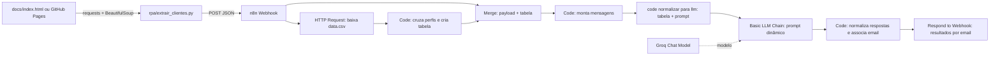

# Assistente de Investimentos com RPA e n8n

Implementação local do MVP do laboratório da DIO. O fluxo extrai clientes fictícios da página HTML, cruza os perfis em uma tabela, monta os dados, normaliza a entrada para o LLM e envia o prompt dinâmico ao Groq Chat Model.

> **Escopo:** demonstração educacional com dados fictícios. As mensagens não são recomendações individualizadas, não executam transações e não devem ser usadas para orientar investimentos reais.

## Arquitetura



O workflow baixa a URL `investimentosCsvUrl` recebida no payload, com fallback para `https://digitalinnovationone.github.io/dio-lab-assistente-investimentos-rpa-n8n/data.csv`. O notebook e o script usam a página de clientes pública da DIO por padrão. Se você fizer um fork, indique a URL da sua página com `CLIENTES_URL` e passe a URL do CSV com `--investimentos-csv-url` (ou `INVESTMENTS_CSV_URL`); não é necessário editar o workflow.

## Conteúdo

- `rpa/extrair_clientes.py`: scraper reutilizável e cliente HTTP para o webhook.
- `rpa/extrair_clientes.ipynb`: versão didática para Google Colab/Jupyter, com o ponto de configuração do webhook.
- `n8n/workflow.json`: workflow exportado para importar no n8n.
- `n8n/code-cruzar-perfis.js`: fonte do nó que faz somente o cruzamento e monta `tabelaCruzada`.
- `n8n/code-montar-mensagens.js`: fonte do nó após o Merge que gera as mensagens.
- `n8n/code-normalizar-llm.js`: normaliza as mensagens em `tabelaParaLLM` e cria o campo `promptLLM` para o próximo nó.
- `n8n/code-normalizar-resposta-llm.js`: normaliza a resposta do LLM, recupera o email de cada item e agrega o resultado.
- O node `Basic LLM Chain` usa `={{ $json.promptLLM }}`; o Groq Chat Model precisa ter uma credencial válida selecionada no n8n.
- `docs/index.html` e `docs/data.csv`: fontes públicas de demonstração mantidas pelo repositório da DIO.
- `tests/test_extrair_clientes.py`: testes locais do scraper e do formato do workflow.

## 1. Preparar Python

Python 3.10 ou superior:

```bash
python -m venv .venv
source .venv/bin/activate        # Windows: .venv\\Scripts\\activate
pip install -r requirements.txt
```

## 2. Importar o workflow no n8n

1. Abra o n8n e escolha **Workflows → Import from File**.
2. Selecione `n8n/workflow.json`.
3. Salve o workflow e execute **Test workflow** para que o Webhook exponha a URL de teste.
4. Copie a **Test URL** do nó `Webhook - Clientes1` para a variável `N8N_WEBHOOK_URL` (mantenha a execução de teste ativa enquanto testa).
5. Para uso normal, ative o workflow no n8n e use a **Production URL**. Guarde a URL do webhook como segredo: não a publique em código, notebook compartilhado ou Git.

O nó `Baixar catálogo CSV1` usa a URL pública da DIO. O workflow fica inativo após a importação até você ativá-lo.

O node `code normalizar para llm` transforma os resultados em **um item por email**, cada um com os campos normalizados e seu próprio `promptLLM`. O `Basic LLM Chain` processa esses items individualmente. O node `Code - Normalizar saída LLM` recupera o email correspondente, extrai `mensagem_llm` e junta os resultados em um único JSON para o webhook. Confirme a credencial do Groq no n8n antes de executar.

## Próxima etapa: IF, envio Gmail e resposta ao RPA

Após `Code - Normalizar saída LLM`, a etapa solicitada é separar cada destinatário com um node **IF**. O ramo **true** segue para **Gmail → Send Message**, usando `={{ $json.sendTo }}` em **To**, `={{ $json.subject }}` em **Subject** e `={{ $json.body }}` em **Message** (tipo de mensagem **Text**); após o envio, o fluxo responde ao RPA. O ramo **false** não envia e-mail e responde ao RPA informando que o endereço foi rejeitado.

**Condição do IF:** `={{ $json.email_valido }}` é `true`. Atenção: no Code atual, `email_valido` verifica apenas o formato do endereço; não confirma que a caixa postal existe. Sem serviço externo ou confirmação do destinatário, endereços inexistentes mas com formato válido não serão identificados como falsos.

**Estado do arquivo exportado:** `n8n/workflow.json` ainda conecta `Code - Normalizar saída LLM` diretamente a `Responder ao RPA1`; os nodes IF e Gmail descritos acima precisam ser adicionados no editor do n8n.

## 3. Validar sem enviar dados

O padrão do script é buscar a página pública da DIO. Para testar sem chamar qualquer webhook:

```bash
python rpa/extrair_clientes.py --dry-run
```

Também é possível apontar para um HTML local:

```bash
python rpa/extrair_clientes.py \
  --clientes-url docs/index.html \
  --dry-run
```

O dry-run imprime o payload JSON que seria enviado e não faz POST.

## 4. Executar ponta a ponta

Linux/macOS:

```bash
export N8N_WEBHOOK_URL='https://SEU-N8N/webhook-test/assistente-investimentos'
python rpa/extrair_clientes.py
```

Windows PowerShell:

```powershell
$env:N8N_WEBHOOK_URL = 'https://SEU-N8N/webhook-test/assistente-investimentos'
python rpa/extrair_clientes.py
```

Para usar endereços diferentes:

```bash
python rpa/extrair_clientes.py \
  --clientes-url 'https://seu-usuario.github.io/seu-fork/' \
  --investimentos-csv-url 'https://seu-usuario.github.io/seu-fork/data.csv' \
  --webhook-url 'https://SEU-N8N/webhook-test/assistente-investimentos'
```

O formato enviado é:

```json
{
  "requestId": "identificador-gerado-a-cada-execução",
  "clientes": [
    {"nome": "Ana Silva", "email": "ana@email.com", "saldo": "R$ 12.500,00", "perfil": "Conservador"}
  ],
  "investimentosCsvUrl": "https://digitalinnovationone.github.io/dio-lab-assistente-investimentos-rpa-n8n/data.csv"
}
```

A resposta do webhook contém `totalClientes` e `resultados`, com os campos do cliente, a opção elegível selecionada, a mensagem e o aviso educacional. A regra de demonstração escolhe, entre as opções do perfil cujo mínimo cabe no saldo informado, a opção com maior aplicação mínima. Isso é apenas uma regra determinística para demonstrar o cruzamento de dados.

## 5. Notebook

Abra `rpa/extrair_clientes.ipynb` no Google Colab ou Jupyter. Instale as dependências, preencha a URL do webhook apenas na sessão do notebook (não salve nem compartilhe uma cópia com a URL) e execute as células em ordem. O script `rpa/extrair_clientes.py` oferece a mesma funcionalidade pela linha de comando.

## 6. Testes

```bash
python -m unittest discover -s tests -v
```

Os testes não fazem chamadas de rede nem enviam dados ao n8n.

## Extensão opcional com IA generativa

O workflow entregue implementa o **MVP de mensagens estáticas**, sem exigir chave de modelo ou credenciais. Como extensão, substitua a construção de `mensagem` no nó **Cruzar perfis e gerar mensagens** por um nó de IA configurado no seu próprio n8n. Use credenciais guardadas no gerenciador de credenciais do n8n; não inclua chaves no JSON exportado. Instrua o modelo a resumir os dados fictícios e explicar o perfil sem prometer retorno, sem inventar dados e sem executar ações. Mantenha o aviso educacional na resposta.
